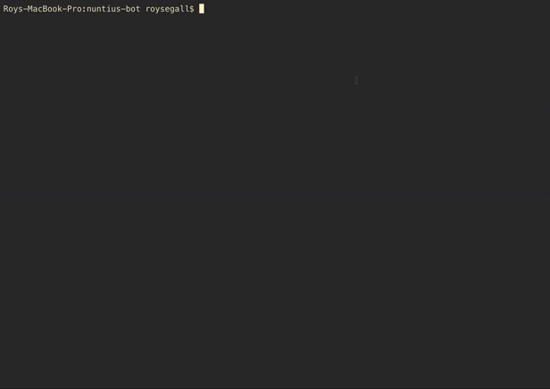

[Gizra](http://gizra.com) became a company when a lot of the employees are 
remote: USA, Canada, Spain and the list goes on. That status required from us to
start using Slack. But the problem is that we wanted Slack to be cool. The
obvious idea is to have a bot. The bot will interact with us and might improve 
the way we communicate.

## Origin
Like any awesome superhero, Nuntius have an origin story. It's not a tragic 
origin story when his uncle-CPU died due to lack of understanding that with 
great power comes great responsibility.

Nuntius in Latin means messages. That was the original project - a chat based on
any backend technology: Drupal, Wordpress, NodeJS, etc., etc. that could connect
to any front end technology(React, Elm, Angular, etc., etc.) and using any 
WebSocket service(Socket.IO, Pusher, FireBase). The project was too much for a 
single man but the name lived on.

## Set up.
You'll need PHP 5.6 and above, [Composer](http://getcomposer.org) and 
[RethinkDB](http://rethinkdb.com).

After creating a bot, Go to `https://YOURTEAM.slack.com/apps`. Click on `Manage`
and under `Custom integration` you'll see your bot. Click on the bot to get the
access token.

Install composer components and start RethinkDB:

``` bash
composer install
rethinkdb
```

Let's start and run the installe:
```bash
php console.php nuntius:install
```

After that will finish you need to run 
```bash
php console.php nuntius:run
```



That's it. Nuntius is up and running.

## Integrating
Nuntius integrations is done through the `hooks.yml` file. All the events,
entities, tasks and other features(you will soon see) are listed in `hooks.yml`.
In case you forked the project, and that the reasonable scenario, you need to
create a `hooks.local.yml` in the settings directory.

The `hooks.local.yml` allow you to override the definitions in `hooks.yml` thus
gives you the option to swap everything in the system.
